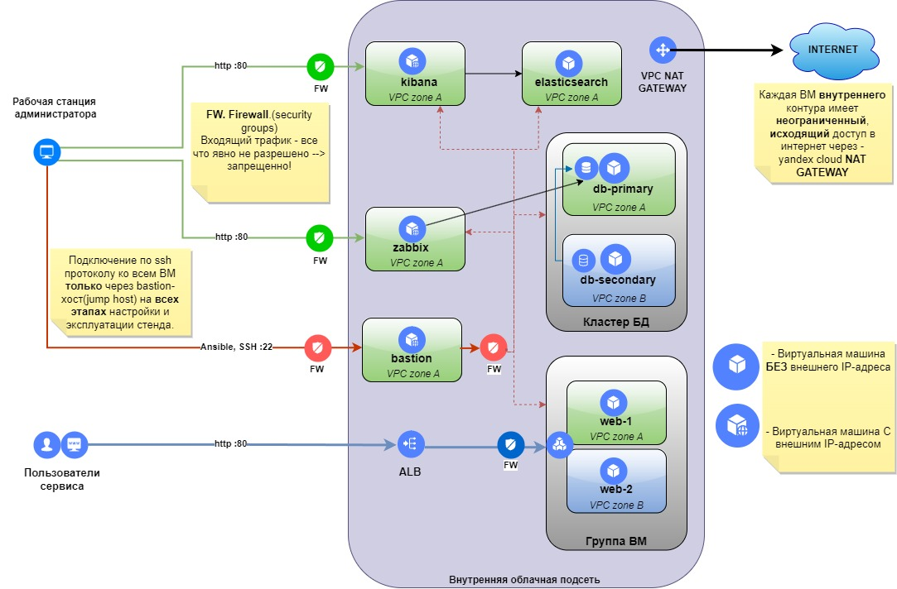

#  Дипломная работа по профессии «Системный администратор»

Содержание
==========
* [Задача](#Задача)
* [Инфраструктура](#Инфраструктура)
    * [Сайт](#Сайт)
    * [Мониторинг](#Мониторинг)
    * [Логи](#Логи)
    * [Сеть](#Сеть)
    * [Резервное копирование](#Резервное-копирование)
    * [Дополнительно](#Дополнительно)
* [Выполнение работы](#Выполнение-работы)
* [Критерии сдачи](#Критерии-сдачи)
* [Как правильно задавать вопросы дипломному руководителю](#Как-правильно-задавать-вопросы-дипломному-руководителю) 

---------

## Задача
Ключевая задача — разработать отказоустойчивую инфраструктуру для сайта, включающую мониторинг, сбор логов и резервное копирование основных данных. Инфраструктура должна размещаться в [Yandex Cloud](https://cloud.yandex.com/) и отвечать минимальным стандартам безопасности: запрещается выкладывать токен от облака в git. Используйте [инструкцию](https://cloud.yandex.ru/docs/tutorials/infrastructure-management/terraform-quickstart#get-credentials).

**Перед началом работы над дипломным заданием изучите [Инструкция по экономии облачных ресурсов](https://github.com/netology-code/devops-materials/blob/master/cloudwork.MD).**

## Схема проекта
[Schema-pdf](https://github.com/netology-code/sys-diplom/blob/diplom-schema/sysadmin.drawio.pdf).




## Инфраструктура
Для развёртывания и конфигурации вашей инфраструктуры используйте Terraform и Ansible!

Не используйте для ansible inventory ip-адреса! Вместо этого используйте fqdn имена виртуальных машин в зоне ".ru-central1.internal". Пример: example.ru-central1.internal  

Важно: используйте по-возможности **минимальные конфигурации ВМ**:2 ядра 20% Intel ice lake, 2-4Гб памяти, 10hdd, прерываемая. 

**Так как прерываемая ВМ проработает не больше 24ч, перед сдачей работы на проверку дипломному руководителю сделайте ваши ВМ постоянно работающими.**

Ознакомьтесь со всеми пунктами из этой секции, не беритесь сразу выполнять задание, не дочитав до конца. Пункты взаимосвязаны и могут влиять друг на друга.

### Сеть
Разверните одну облачную сеть в VPC. Создайте в ней 2 подсети в зонах A и B.

Настройте 1 ВМ с публичным адресом.  Эта ВМ будет реализовывать концепцию  [bastion host]( https://cloud.yandex.ru/docs/tutorials/routing/bastion) . Синоним "bastion host" - "Jump host". Подключение  ansible к серверам внутренней сети через  bastion host можно сделать с помощью  [ProxyCommand](https://docs.ansible.com/ansible/latest/network/user_guide/network_debug_troubleshooting.html#network-delegate-to-vs-proxycommand) .

Сервера web, elasticsearch, databases должны находиться во внутреннем контуре, те **не** иметь внешних IP-адресов.
Серверам Zabbix, Kibana, bastion назначьте внешний IP-адрес.

Настройте облачный FIREWALL [Security Groups](https://cloud.yandex.com/docs/vpc/concepts/security-groups) соответствующих сервисов(zabbix, kibana, bastion) на входящий трафик только к нужным портам.

Примечание:
```
Доступ к ВМ внутреннего и внешнего контура по ssh осуществляется только через бастион-сервер.
Доступ к web-порту ВМ-web через облачный балансировщик yandex cloud(ALB).
Доступ к web-порту zabbix/kibana по их внешнему IP-адресу.
```


### Сайт
Создайте две ВМ в разных зонах(подсети A и B), установите на них web-сервер nginx, если его там нет. ОС и содержимое ВМ должно быть идентичным. Используйте набор статичных файлов для главной страницы сайта. Можно переиспользовать сайт из домашнего задания или поискать [примеры](https://htmlacademy.ru/blog/html/free-html-template) в интернете.  

Настройка облачного балансировщика:

1. Создайте [Target Group](https://cloud.yandex.com/docs/application-load-balancer/concepts/target-group), включите в неё две созданных ВМ.

2. Создайте [Backend Group](https://cloud.yandex.com/docs/application-load-balancer/concepts/backend-group), настройте backends на target group, ранее созданную. Настройте healthcheck на корень (/) и порт 80, протокол HTTP.

3. Создайте [HTTP router](https://cloud.yandex.com/docs/application-load-balancer/concepts/http-router). Путь укажите — /, backend group — созданную ранее.

4. Создайте [Application load balancer](https://cloud.yandex.com/en/docs/application-load-balancer/) для распределения трафика на веб-сервера, созданные ранее. Укажите HTTP router, созданный ранее, задайте listener тип auto, порт 80.

Протестируйте сайт
`curl -v <публичный IP балансера>:80` 

### Мониторинг
Настройте отказоустойчивый кластер  БД mysql или postgresql в разных зонах(подсети A и B). Для этого создайте 2 ВМ для PRIMARY и SECONDARY сервера Базы данных, настройте между ними репликацию данных. Используйте для zabbix учетную запись БД с ограниченными правами.

Разверните ВМ с Zabbix-server, в качестве его БД используйте ранее развернутый вами кластер БД. 

На  ВМ(web-1, web-2 ) установите Zabbix Agent, настройте агенты на отправку метрик в Zabbix.

Настройте дешборды с отображением метрик, минимальный набор — по принципу USE (Utilization, Saturation, Errors) для CPU, RAM, диски, сеть, http запросов к веб-серверам. Добавьте необходимые tresholds на соответствующие графики.

### Логи
Cоздайте ВМ, разверните на ней Elasticsearch. Установите filebeat в ВМ к веб-серверам, настройте на отправку access.log, error.log nginx в Elasticsearch.

Создайте ВМ, разверните на ней Kibana, сконфигурируйте соединение с Elasticsearch.


### Резервное копирование
Создайте snapshot(с помощью кода терраформ) дисков всех ВМ. Ограничьте время жизни snaphot в неделю. Сами snaphot настройте на ежедневное копирование.

### Дополнительно
Не входит в минимальные требования. 

1. Для Zabbix можно реализовать разделение компонент - frontend, backend. Frontend отдельной ВМ поместите в публичную подсеть, назначте публичный IP. Server поместите в приватную подсеть, настройте security group на разрешение трафика между frontend и server.
2. В Elasticsearch добавьте мониторинг логов самого себя, Kibana, Zabbix, через filebeat.
3. Воспользуйтесь Yandex Certificate Manager, выпустите сертификат для сайта, если у вас есть купленное доменное имя. Перенастройте работу балансировщика на HTTPS, при этом нацелен он будет на HTTP порт веб-серверов(те терминировать TLS).
4. Настройте резервное копирование с помощью дампа базы данных в S3-бакет.

## Выполнение работы
На этом этапе вы непосредственно выполняете работу. При этом вы можете консультироваться с руководителем по поводу вопросов, требующих уточнения.

⚠️ В случае недоступности ресурсов Elastic для скачивания рекомендуется разворачивать сервисы с помощью docker контейнеров, основанных на официальных образах.

**Важно**: Можно задавать руководителю вопросы по поводу того, каким именно способом реализовать ту или иную функциональность. Любые вопросы, которые не освещены в этом документе, стоит уточнять у руководителя. Если его требования и указания расходятся с указанными в этом документе, то приоритетны требования и указания руководителя. Организационные вопросы задавайте координаторам!

## Критерии сдачи
1. Инфраструктура отвечает минимальным требованиям, описанным в [Задаче](#Задача).
2. Предоставлен доступ ко всем ресурсам, у которых предполагается веб-страница (сайт, Kibana, Zabbix).
3. Для ресурсов, к которым предоставить доступ проблематично, предоставлены скриншоты, команды, stdout, stderr, подтверждающие работу ресурса.
4. Работа оформлена в отдельном репозитории в GitHub, разрешён доступ по ссылке. 
5. Код размещён в репозитории в GitHub.
6. Работа оформлена так, чтобы были понятны ваши решения и компромиссы. 
7. Если использованы дополнительные репозитории, доступ к ним открыт. 

## Как правильно задавать вопросы дипломному руководителю
Что поможет решить большинство частых проблем:
1. Попробовать найти ответ сначала самостоятельно в интернете или в материалах курса и только после этого спрашивать у дипломного руководителя. Навык поиска ответов пригодится вам в профессиональной деятельности.
2. Если вопросов больше одного, присылайте их в виде нумерованного списка. Так дипломному руководителю будет проще отвечать на каждый из них. Желательно прочесть [мини-статью](https://neprivet.com/).
3. При необходимости прикрепите к вопросу скриншоты и стрелочкой покажите, где не получается. Программу для этого можно скачать [здесь](https://app.prntscr.com/ru/).


Что может стать источником проблем:
1. Вопросы вида «Ничего не работает. Не запускается. Всё сломалось». Дипломный руководитель не сможет ответить на такой вопрос без дополнительных уточнений. Цените своё время и время других.
2. Откладывание выполнения дипломной работы на последний момент.
3. Ожидание моментального ответа на свой вопрос. Дипломные руководители — работающие инженеры, которые занимаются, кроме преподавания, своими проектами. Их время ограничено, поэтому постарайтесь задавать правильные вопросы, чтобы получать быстрые ответы :)
